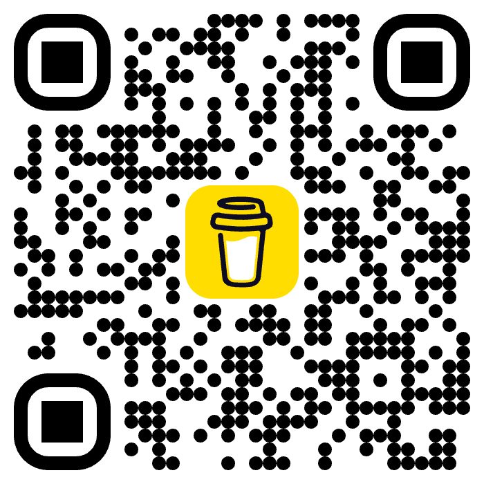

# Moodito

[](https://sonarcloud.io/summary/overall?id=georgiosnikitas_moodito)
[](https://github.com/georgiosnikitas/moodito/actions/workflows/ci.yml)
[](https://github.com/georgiosnikitas/moodito/actions/workflows/release.yml)
[](https://www.python.org/)
[](https://www.apple.com/macos/)
[](LICENSE)
[](https://buymeacoffee.com/georgiosnikitas)

**Your mood, live in the menu bar.** Moodito is a tiny, privacy-first macOS
menu bar companion that reads your face through the webcam and shows how you're
feeling right now — as a friendly emoji and label — without ever leaving your
Mac. No accounts, no cloud, no frames uploaded anywhere: every detection happens
100% on-device.

But Moodito is more than a fun face emoji. It quietly builds a picture of your
emotional day, turns it into beautiful in-menu **charts**, and — if you connect
your favourite AI provider — writes you a personalised **wellbeing report** with
suggestions to feel better. Think of it as a gentle, always-on mood mirror that
lives one click away in your menu bar.

Emotion recognition is powered by **Google's MediaPipe Face Landmarker**, which
produces ARKit-style facial *blendshapes*. Moodito maps those blendshapes to a
small set of coarse emotions: happy, sad, surprised, angry, and neutral.

## Features

Everything lives in the menu bar dropdown — small, fast, and out of your way.

- **🙂 Live emotion in the menu bar** — your current mood shown as an emoji +
  label (e.g. `😀 happy`), refreshed several times a second. The top **Detected**
  row shows the recognised emotion and its confidence.
- **📊 Insights submenu** — a rich, at-a-glance dashboard built entirely from
  your own on-device history:
  - **Activity chart** — how much you've been at your Mac, by hour of day.
  - **Emotion heatmap** — a per-emotion grid across the hours of the day, so you
    can spot when you tend to be happy, stressed, or focused.
  - **Statistics table** — time spent and occurrences for every state (happy,
    sad, surprised, angry, neutral, no face, paused, error) plus totals.
- **🕒 Selectable date range** — by default the insights cover a live, sliding
  **Last 24 Hours** window. With an active license you can turn that off and use
  **Since** / **Range…** to compute the insights over any custom start/end you
  like. Without a license, the range stays pinned to the last 24 hours.
- **✨ AI-powered Mood Tip** — ask your configured AI provider for a detailed,
  personalised wellbeing report based on your selected date range, delivered in
  a scrollable in-app window. **Save as PDF** to export a polished, branded
  report — complete with the Moodito badge, generation date, date range,
  face-scanning time, a full per-emotion breakdown (occurrences, share and
  duration, with totals) and the AI provider/model used.
- **🔌 Bring your own AI provider** — connect **Anthropic**, **Gemini**,
  **OpenAI**, any **OpenAI-compatible** endpoint, or local **Ollama**. Credentials
  are stored locally, and a built-in **Test** button verifies the connection
  before you save.
- **🎚️ Adjustable sensitivity** — fine-tune detection per emotion (Low / Normal /
  High) so Moodito reads *your* face the way you want.
- **🔒 Automatic Privacy** — set independent no-face delays for microphone mute,
  speaker mute, and screen lock using hours (`0–23`), minutes (`0–59`), and
  seconds (`0–59`). All three at `0` disables that action. When your face
  returns, Moodito restores the exact audio levels and speaker mute state that
  were active before Privacy engaged.
- **⏱️ Break Timer** — set a countdown in hours, minutes, and seconds. An active
  timer shows a clock in the macOS menu bar. When it finishes, Moodito opens a
  reminder to take a break, then starts a fresh countdown after you dismiss it.
  A configurable `0–99%` no-face threshold resets the countdown after a
  sufficiently long time away.
- **🔔 Configurable notifications** — independently control notifications for
  Privacy audio, data-range and export actions, Mood Tips and PDFs, settings
  changes, pause/resume, each detected emotion, license changes, and quitting.
  The grouped, scrollable settings window includes Enable All / Disable All
  controls and a live enabled count.
- **🖼️ Customisable display** — toggle **Show Emojis** and **Show Labels**
  independently, or fall back to the clean Moodito icon.
- **⏸️ Pause / Resume** — instantly stop processing webcam frames whenever you
  want privacy or a break.
- **📷 Camera access helper** — a one-click shortcut to grant or re-grant webcam
  permission.
- **💾 Export & erase** — **Download (csv)** your raw detection log, or **Erase**
  all collected data at any time. Your data, your call.
- **🔑 Licensing** — manage your Lemon Squeezy license (buy, activate, deactivate,
  manage) right from the menu.
- **☕ Buy Me a Coffee** — a built-in tip jar with a handy QR code if you'd like
  to support development.

## Requirements

- macOS
- Python 3.11–3.13 (MediaPipe wheels are not yet published for 3.13+)
- A webcam

## Setup

```bash
python3 -m venv .venv
source .venv/bin/activate
pip install -r requirements.txt
```

## Run

```bash
python app.py
```

On first launch Moodito downloads the MediaPipe `face_landmarker.task` model
(~3.7 MB) next to `app.py`. macOS will prompt for **camera permission** the
first time — grant it, otherwise the app shows a "could not open webcam" error.

The menu bar shows the live emotion (e.g. `😀 happy`), and the dropdown gives you
the full experience described in [Features](#features).

## Build a standalone .app

To produce a double-clickable `Moodito.app` that doesn't need a terminal or an
activated virtualenv:

```bash
./build.sh
```

This uses PyInstaller (see [`moodito.spec`](moodito.spec)) and writes
`dist/Moodito.app`. The bundle is configured as a menu-bar-only app
(`LSUIElement`) and declares `NSCameraUsageDescription`, so on first launch
macOS prompts for camera access for **Moodito** itself.

```bash
open dist/Moodito.app            # run it
cp -R dist/Moodito.app /Applications/   # install it
```

The app is unsigned, so the first launch may require right-click -> **Open** (or
allowing it under System Settings -> Privacy & Security). The model is cached in
`~/Library/Application Support/Moodito/`.

## How it works

1. `app.py` captures webcam frames with OpenCV on a background thread.
2. Each frame is passed to MediaPipe Face Landmarker (`detect_for_video`).
3. The 52 blendshape scores are mapped to an emotion in `emotion.py`.
4. A `rumps` timer refreshes the menu bar title every 0.3s.
5. Detections are logged on-device and aggregated into the **Insights** charts
   and statistics over your selected date range.
6. On request, the **Mood Tip** feature sends a summary of that range to your
   configured AI provider to generate a wellbeing report, which you can export
   as a styled PDF.

Everything in steps 1–5 stays entirely on your Mac. Only the optional Mood Tip
in step 6 contacts the AI provider you explicitly configure.

## Tuning

The emotion heuristics live in [`emotion.py`](emotion.py) in `infer_emotion()`.
Adjust the linear weights or the `0.25` neutral threshold to make detection more
or less sensitive.

## Licensing

Moodito integrates with [Lemon Squeezy](https://www.lemonsqueezy.com/) for
license management. A license unlocks **custom date ranges** for the Insights
(without one, the insights stay pinned to the live **Last 24 Hours** window). The
**License** submenu in the menu bar dropdown shows your current **Status**, **Key**,
and **Device** (when licensed) and offers:

- **Activate License…** — prompts for your key and activates it (shown only while
  unlicensed)
- **Deactivate License** — releases this device's activation (shown only while
  licensed)
- **Manage License…** — opens your [Lemon Squeezy orders](https://app.lemonsqueezy.com/my-orders)
  to look up a key you already bought
- **Buy License…** — opens the [storefront](https://georgiosnikitas.lemonsqueezy.com/)

Activation is verified against the Lemon Squeezy
[License API](https://docs.lemonsqueezy.com/api/license-api) and stored in
`~/Library/Application Support/Moodito/license.json`. A licensed copy re-validates
on launch and periodically in the background; if the key has expired or been
deactivated elsewhere, Moodito falls back to the unlicensed experience. Network
errors are treated as transient and never revoke a license. While a license is
active, the Buy Me a Coffee tip jar is hidden.

## Support

If you enjoy Moodito, you can support development by buying me a coffee ☕

[buymeacoffee.com/georgiosnikitas](https://buymeacoffee.com/georgiosnikitas)



There's also a **Buy Me a Coffee ☕** item in the menu bar dropdown that opens
the page directly.

## License

Moodito is released under the [MIT License](LICENSE).

